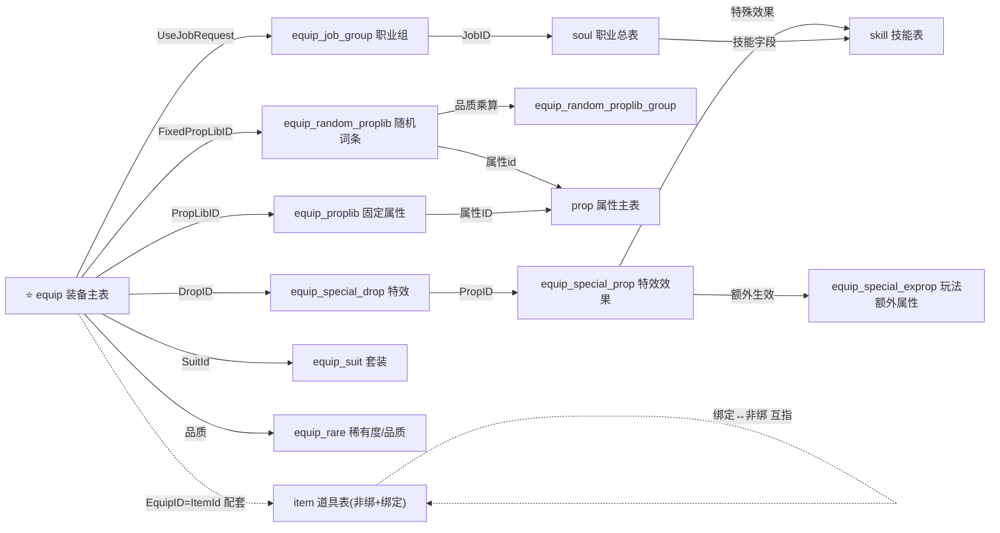

# 00 · 导读：装备配置体系分析（思路 + 关系图 + 文档地图）

> 这份导读用来**对外讲清**：① 我怎么把"装备配置体系"梳理明白的；② 这套体系长什么样（涉及哪些表、怎么关联）；③ 配一件装备要做哪些活；④ 文档怎么用。
> 第一次接触的同学先读这一篇。

---

## 一、做了什么

从一张 `equip.xlsx` 主表出发，**逆向梳理整个装备配置体系**：拆清每个字段怎么填/怎么算、表与表怎么联动，覆盖 **15 张配置表**（主表 + 14 张关联表）+ 通用语言表，画出完整关系图、沉淀出配置流程。

目标：让产品/策划/新人**不打开 Excel 也能看懂装备怎么配**，并为建多维表格、做工具提供数据底座。

---

## 二、分析思路（5 步）

通用方法论（见 [配置表业务梳理方法论](../../配置表业务梳理方法论.md)）在装备上的落地：

1. **从主表入手，先拆"批注 + 公式"**——配置表的真相藏在批注和公式里，不看表面数据。
2. **给每个字段定"来源"**——四分类：手工配置 / 公式生成 / 关联字段 / 关联组合。谁手填、谁自动、谁指向别表，一标就清。
3. **顺着关联爬到闭环**——主表只是"指针表"，顺外键一层层补：主表 → 直接关联 → 二级依赖 → 通用表 → 配套表，直到所有引用有着落。
4. **固化成统一产出**——字段清单（对齐多维表格）+ ER 图。
5. **用真实数据验证、用大白话打磨**——结论回原表核对，描述改到"第一次看也能懂"。

---

## 三、三个核心结论

1. **equip 主表是"半自动生成"的**：策划只手填约 10 个维度（部位/职业/转数/分支/品质/第几套/挂件/图标…），其余 30+ 列（装备ID、属性库ID、职业限制、穿戴等级、名称/描述…）全由公式联动 `Sheet4` 字典页自动算出。
2. **大量 ID 是"自洽编码"——既是外键、又能公式拼出**：关联表用同一套编码规则，equip 拿自己的维度一拼正好是对方已存在的 ID。好处是少手填；风险是关联表漏建会产生"悬空外键"。
3. **一件装备牵动一条链**：equip 只存指针，真实内容分散在 15 张表——能被谁穿、加什么属性、抽什么词条、带什么特效、属于什么套装，以及背包里的"道具形态"。

---

## 四、关联表一览（配置任务涉及的表）

> 「关联关系」列读法：**哪个表的哪个字段 → 本表的哪个字段**（源字段 → 目标字段）。

| # | 表 | 角色 | 层级 | 关联关系（源表.源字段 → 本表.目标字段） |
|---|----|------|------|------------------------------------|
| 1 | **equip** | 装备主表（清单+指针） | 主表 | — |
| 2 | equip_job_group | 职业组（谁能穿） | 一级直连 | equip.使用职业限制(UseJobRequest) → 本表.组ID(GroupID) |
| 3 | equip_proplib | 固定基础属性库 | 一级直连 | equip.初始基础属性库id(PropLibID) → 本表.属性库ID(PropLibID) |
| 4 | equip_random_proplib | 随机词条库 | 一级直连 | equip.初始随机属性库id(FixedPropLibID)、装备技能随机库(RandonSkillID) → 本表.随机库ID(RandomPropLib) |
| 5 | equip_special_drop | 特效库 | 一级直连 | equip.特殊属性库ID(DropID) → 本表.属性库ID(DropID) |
| 6 | equip_suit | 套装 | 一级直连 | equip.初始套装库(SuitId) → 本表.套装编号(SuitId) |
| 7 | equip_rare | 稀有度/品质映射 | 一级直连 | equip.品质(Remark8) → 本表.装备品质(EquipRare)，取出道具品质(Rare)/强度子品质(StrengthRare) |
| 8 | equip_random_proplib_group | 随机词条品质乘算/概率 | 二级 | equip_random_proplib.品质 → 本表.装备品质(EquipRare) |
| 9 | equip_special_prop | 特效具体效果(技能) | 二级 | equip_special_drop.属性ID(PropID) → 本表.特殊效果ID(PropID) |
| 10 | equip_special_exprop | 玩法/位面额外属性（当前空） | 二级 | equip_special_prop.额外生效 → 本表.属性ID(PropID) |
| 11 | soul | 职业总表/职业树根表 | 二级 | equip_job_group.职业ID(JobID) → 本表.职业ID(SoulID) |
| 12 | language | 通用语言表（文案） | 通用 | 各表的语言包Key字段（如 equip.装备名称语言包、equip_suit.套装名称…）→ 本表.主键(Id) |
| 13 | item | 道具表（装备的"道具形态"，含绑定/非绑） | 配套 | equip.装备ID(EquipID) = 本表.道具ID(ItemId)；绑定版 ItemId = "8"+装备ID |
| 14 | prop | 属性主表（属性名↔编号） | 通用 | equip_proplib.属性值、equip_random_proplib.属性id、equip_special_exprop.额外生效属性（里的属性ID）→ 本表.属性编号(Id) |
| 15 | skill | 技能表（特效/职业技能） | 通用 | equip_special_prop.特殊效果、soul.初始技能/闪避/普攻 → 本表.技能id(Id) |

> 另有 `equip_random_proplib_skill`（废弃冗余表，勿用）。逐字段清单见 [09](09_关联表字段清单.md)。

---

## 五、关系总览（ER 图）

主干关系（实线=引用，虚线=配套）：

> 上图是"看主干"的简化版。带主键/外键/基数(一对多/多对多/自关联)的**完整 ER 图**见 [08 ER关系图](08_ER关系图.md)。

---

## 六、配一个装备通常要做哪些工作

完整流程见 [10 装备配置流程](10_装备配置流程.md)，概览如下（顺序：先备库 → 再配本体 → 后配套）：

**前置：确保关联库就绪**
- 全局字典（prop/品质/职业/Sheet4）一般已建好，不用动。
- 按需补库：该"部位×转数×品质×等级"没有属性库就补 equip_proplib；要新随机词条补 equip_random_proplib；新职业组合补 equip_job_group；要特效补 equip_special_prop + equip_special_drop；要套装补 equip_suit。

**本体：在 equip 填维度**
- 手填部位/职业/转数/分支/品质/第几套/挂件/图标（+套装/技能随机库按需）；其余 ID、名称、等级等自动生成。
- 校验自动拼出的各 ID 在对应库里都存在（防悬空外键）。

**配套：道具 + 文案**
- 在 item 配两条道具：非绑（ItemId=装备ID）+ 绑定（ItemId="8"+装备ID），L/M 字段互指。
- 在 language 补名称/描述/套装名的中文文案。
- 带特效/套装的：在 equip 备注写"特效"/"套装"开关，并把对应库配好。

> 一句话：**备库 → equip 填维度（其余自动）→ 校验不悬空 → item 配套两条道具 → language 补文案 →（按需）开特效/套装。**

---

## 七、文档地图

| 文档 | 内容 | 主要给谁看 |
|------|------|-----------|
| **00 导读**（本篇） | 思路 + 关系图 + 配置概览 + 文档地图 | 所有人，先读 |
| [01 表结构与导出规则](01_表结构与导出规则.md) | 表头4行、A/N/S/C导出标记、手填vs公式 | 想懂表怎么组织 |
| [02 字段字典与公式拆解](02_字段字典与公式拆解.md) | equip 55列逐列+公式翻译 | 抠某字段/公式 |
| [03 Sheet4参照数据字典](03_Sheet4参照数据字典.md) | Sheet4 的14个字典区块（截图+真实数据） | 查字典/核对数值 |
| [04 ID编码规则速查](04_ID编码规则速查.md) | 各拼接型ID规则 + 反查 | 看到ID想读懂 |
| [05 字段清单表](05_字段清单表.md) ⭐ | equip 主表字段清单（对齐多维表格） | 最常用：建表/懂主表 |
| [06 关联配置表说明](06_关联配置表说明.md) | 直接关联5张表 + 数据流 | 懂表间数据流 |
| [07 深层依赖表说明](07_深层依赖表说明.md) | 二级依赖表 | 深入关联链 |
| [08 ER关系图](08_ER关系图.md) ⭐ | 15张表完整ER图 + 简化图 | 一图看全局 |
| [09 关联表字段清单](09_关联表字段清单.md) ⭐ | 14张关联表逐字段清单 | 建表/懂关联表 |
| [10 装备配置流程](10_装备配置流程.md) ⭐ | 配装备分步SOP（含前置库配置） | 实际配装备时 |
| **—— 工具化设计系列（11~15）——** | 从"业务梳理"走向"配置中心"工具 | 做工具 / 设计评审 |
| [11 对标发行活动配置工具](11_对标发行活动配置工具的工具化分析.md) | 把装备配表套进活动配置范式：概念映射 + 控件类型词表 | 想懂工具化思路 |
| [12 配置中心设计规范](12_装备配置工具设计规范.md) | 视觉/页面/关联抽屉/配置状态/平台架构 + **加载回写与变更记录**（§十三） | 做 UI / 工具设计 |
| [13 字段配置标准（表与字段Schema）](13_字段配置标准（表与字段Schema）.md) | 每张表的声明式 schema（控件/编码/关联下钻）+ AI 辅助规则编写 | 配规则 / 做规则引擎 |
| [14 工具化设计评审意见](14_工具化设计评审意见.md) | 11/12/13 + demo 的评审与定论（含 Q1/Q2 实测结论） | 复盘 / 查定论 |
| [15 工具开发实施指南](15_工具开发实施指南.md) ⭐ | **交付开发 AI 的蓝图**：架构 + 模块 M1~M10 + 红线 + 里程碑 | 真正开发时 |

> ⭐ = 业务梳理 4 份 + 开发蓝图 15。00~10 是**业务梳理**、11~15 是**工具化设计**（15 是开发交接）；交互演示见 [demo/装备配置工具.html](demo/装备配置工具.html)。方法论见上一级 [配置表业务梳理方法论](../../配置表业务梳理方法论.md)。

---

## 八、按场景怎么用

- **5 分钟搞懂装备体系** → 本篇"三个核心结论" + "五、关系总览"。
- **要建飞书多维表格** → [05](05_字段清单表.md) + [09](09_关联表字段清单.md)（已对齐列结构、标好关联）。
- **要配一件装备** → [10 装备配置流程](10_装备配置流程.md)。
- **看到某ID/字段看不懂** → [04 编码速查](04_ID编码规则速查.md) / [02 字段拆解](02_字段字典与公式拆解.md)。
- **核对 Sheet4 具体数值** → [03](03_Sheet4参照数据字典.md)。

---

## 九、范围与边界

- 已完整收录：equip 主表 + 14 张关联表。
- **暂未展开（已标注）**：skill 的下游技能子系统(buff/damage/param)、item 的 func表/掉落表/流程表、soul 的天赋树表等外围表——属其它模块，不影响装备链主干（清单见 [09 文档末尾](09_关联表字段清单.md)）。
