# 03 · Sheet4 参照数据字典

`Sheet4` 是整张表的"字典页"——主数据页的所有 `XLOOKUP / INDEX / VLOOKUP` 公式查的都是这里。它没有统一表头，而是把十几个独立的小表横向/纵向铺在同一张 sheet 的不同列区里（这也是为什么文档里会出现 `S12:T22` 这种单元格坐标——因为这些小表没有名字，只能靠坐标定位）。

> 坐标记法：`列范围 行范围`。例 `C11:F50` 指 C~F 列、第 11~50 行。
> 每个区块都附了**实际截图**和**真实数据**。

---

## 速览：equip 的哪些字段是从 Sheet4 查出来的

不想看坐标细节的话，看这张表就够了——它把"equip 每个字段**拿什么当钥匙、去 Sheet4 哪块查、查到什么**"一次讲清。本质都是一句话：**拿装备已有的几个维度，去 Sheet4 的某张小表里"对号入座"取出对应值。**

| equip 字段 | 拿什么当钥匙去查 | 查 Sheet4 哪块 | 查到什么 | 例子 |
|-----------|----------------|---------------|---------|------|
| 装备部位(名) `Remark2` | 部位编号 | 部位表 | 部位中文名 | 1 → 武器 |
| 分支职业名称 `Remark7` | 基础职业+转数+分支 | 职业表 | 分支职业名 | 战士+2转+分支1 → 迅剑士 |
| 物理OR魔法备注 `Remark13` | 分支职业名 | 职业表 | 物理 / 魔法 | 战士 → 物理；法师 → 魔法 |
| 品质名称 `Remark9` | 品质编号 | 品质表 | 品质中文名 | 1 → 绿；5 → 橙 |
| 真实等级 `RealLevel` | 转数+第几套 | 真实等级表 | 该装备的真实等级 | 0转第1套 → 对应等级 |
| 转数等级 `Remark16` | 转数+真实等级 | 真实等级表 | 显示等级(当前=真实等级) | — |
| 穿戴等级 `Level` | 转数 | 真实等级表 | 该转最低那档等级 | 转1 → 6 |
| 最大件数 `Remark20` | 转数 × 部位 | 套数矩阵 | 该部位最多几件 | 品质<5 → 1 件 |
| 装备名称内容 `Remark24` | 等级/转数/品质/职业分支 | 命名词库 + 部位词 | 拼出装备名 | 粗制旅人 + 长剑 → 粗制旅人长剑 |
| 装备描述内容 `Remark26` | 转数/品质/命名组 | 文案库 + 部位词 | 拼出装备描述 | 最简单的 + 长剑 + …必备的装备 |
| 散件点数 `EquipPoint` | 品质 | 点亮积分表 | 该品质散件的点数 | 见积分表 |

> 下面是各张小表的明细（含坐标、截图、真实数据），需要核对具体数值时再看。

---

## 区块 1 · 职业表（C:H, 行 11~50）

主键三件套：基础职业 + 转数 + 职业分支 → 分支职业中文名。被 K 列「分支职业名称」、U 列「物理OR魔法备注」查取。

| 列 | 字段 | 说明 |
|----|------|------|
| C | 基础职业 | 1战士 2弓箭手 3魔法师 4牧师 |
| D | 转数 | 0/1/2/3/4 |
| E | 职业分支 | 1/2/3/4 |
| F | 分支职业名 | 见下 |
| G | 物理/魔法 | 该职业的攻击类型 |
| H | 有几套套装 | 该职业转数对应套装数 |

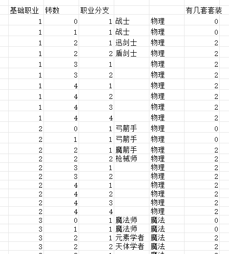

| 基础职业 | 转数 | 职业分支 | 分支职业名 | 物理/魔法 | 有几套套装 |
| ---- | -- | ---- | ---- | -- | ----- |
| 1 | 0 | 1 | 战士 | 物理 | 0 |
| 1 | 1 | 1 | 战士 | 物理 | 0 |
| 1 | 2 | 1 | 迅剑士 | 物理 | 2 |
| 1 | 2 | 2 | 盾剑士 | 物理 | 2 |
| 1 | 3 | 1 |  | 物理 | 2 |
| 1 | 3 | 2 |  | 物理 | 2 |
| 1 | 4 | 1 |  | 物理 | 2 |
| 1 | 4 | 2 |  | 物理 | 2 |
| 1 | 4 | 3 |  | 物理 | 2 |
| 1 | 4 | 4 |  | 物理 | 2 |
| 2 | 0 | 1 | 弓箭手 | 物理 | 0 |
| 2 | 1 | 1 | 弓箭手 | 物理 | 0 |
| 2 | 2 | 1 | 魔箭手 | 物理 | 2 |
| 2 | 2 | 2 | 枪械师 | 物理 | 2 |
| 2 | 3 | 1 |  | 物理 | 2 |
| 2 | 3 | 2 |  | 物理 | 2 |
| 2 | 4 | 1 |  | 物理 | 2 |
| 2 | 4 | 2 |  | 物理 | 2 |
| 2 | 4 | 3 |  | 物理 | 2 |
| 2 | 4 | 4 |  | 物理 | 2 |
| 3 | 0 | 1 | 魔法师 | 魔法 | 0 |
| 3 | 1 | 1 | 魔法师 | 魔法 | 0 |
| 3 | 2 | 1 | 元素学者 | 魔法 | 2 |
| 3 | 2 | 2 | 天体学者 | 魔法 | 2 |
| 3 | 3 | 1 |  | 魔法 | 2 |
| 3 | 3 | 2 |  | 魔法 | 2 |
| 3 | 4 | 1 |  | 魔法 | 2 |
| 3 | 4 | 2 |  | 魔法 | 2 |
| 3 | 4 | 3 |  | 魔法 | 2 |
| 3 | 4 | 4 |  | 魔法 | 2 |
| 4 | 0 | 1 | 牧师 | 魔法 | 0 |
| 4 | 1 | 1 | 牧师 | 魔法 | 0 |
| 4 | 2 | 1 | 辉光修士 | 魔法 | 2 |
| 4 | 2 | 2 | 黯影修士 | 魔法 | 2 |
| 4 | 3 | 1 |  | 魔法 | 2 |
| 4 | 3 | 2 |  | 魔法 | 2 |
| 4 | 4 | 1 |  | 魔法 | 2 |
| 4 | 4 | 2 |  | 魔法 | 2 |
| 4 | 4 | 3 |  | 魔法 | 2 |
| 4 | 4 | 4 |  | 魔法 | 2 |

> 战士物理、弓物理、法师魔法、牧师魔法。3/4转分支名为空，表示当前版本未命名。

---

## 区块 2 · 品质表（N:O, 行 12~18）

品质编号 → 品质中文名。被 M 列「品质名称」查取。

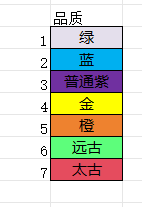

| 编号 | 品质 |
| - | --- |
| 1 | 绿 |
| 2 | 蓝 |
| 3 | 普通紫 |
| 4 | 金 |
| 5 | 橙 |
| 6 | 远古 |
| 7 | 太古 |

---

## 区块 3 · 部位表（S:T, 行 12~22）

部位编号 → 部位中文名。被 F 列「装备部位(名)」查取。

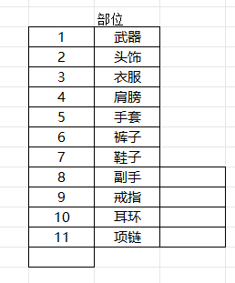

| 编号 | 部位 |
| -- | -- |
| 1 | 武器 |
| 2 | 头饰 |
| 3 | 衣服 |
| 4 | 肩膀 |
| 5 | 手套 |
| 6 | 裤子 |
| 7 | 鞋子 |
| 8 | 副手 |
| 9 | 戒指 |
| 10 | 耳环 |
| 11 | 项链 |

---

## 区块 4 · 套数/部位规则表（O:AO, 行 11~16）

定义"每转数、每部位最多几套/几件"以及职业分支、品质上下限。被 W 列「最大件数」的 INDEX-MATCH 查取。

- `W11:W16` = 转数（0~4）
- `X` 最多防具部位数量、`Y` 最多职业分支、`Z` 最低品质、`AA` 最高品质、`AB` 最多套数、`AC/AD` 首饰部位区间
- `AE10:AO10` = 部位表头（1武器…11项链）
- `AE12:AO16` = **套数矩阵**：行=转数、列=部位，值=该组合最多件数

例：橙色以上武器，按转数查这张矩阵得知最多有几套。

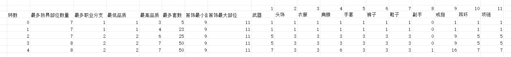

| 转数 | 最多防具部位数量 | 最多职业分支 | 最低品质 | 最高品质 | 最多套数 | 首饰最小部位 | 首饰最大部位 | 武器 | 头饰 | 衣服 | 肩膀 | 手套 | 裤子 | 鞋子 | 副手 | 戒指 | 耳环 | 项链 |
| -- | -------- | ------ | ---- | ---- | ---- | ------ | ------ | -- | -- | -- | -- | -- | -- | -- | -- | -- | -- | -- |
| 0 | 7 | 1 | 1 | 3 | 5 | 9 | 11 | 1 | 1 | 1 | 1 | 1 | 1 | 1 | 0 | 1 | 1 | 1 |
| 1 | 7 | 1 | 1 | 4 | 23 | 9 | 11 | 1 | 1 | 1 | 1 | 1 | 1 | 1 | 0 | 1 | 1 | 1 |
| 2 | 7 | 2 | 2 | 6 | 25 | 9 | 11 | 5 | 3 | 3 | 3 | 3 | 3 | 3 | 0 | 9 | 5 | 5 |
| 3 | 8 | 2 | 2 | 7 | 50 | 9 | 11 | 5 | 3 | 3 | 3 | 3 | 3 | 3 | 0 | 9 | 5 | 5 |
| 4 | 8 | 2 | 2 | 7 | 50 | 9 | 11 | 7 | 3 | 3 | 6 | 3 | 3 | 3 | 1 | 16 | 7 | 7 |

---

## 区块 5 · 真实等级展开表（AU:AX, 行 11~310）★

这是最长的一张表，把「转数 × 第几套」展开成每一档的真实等级与显示等级。被 Q「真实等级」、R「转数等级」、S「穿戴等级」查取。

| 列 | 字段 |
|----|------|
| AU | 转数 |
| AV | 第几套 |
| AW | 真实等级（实际穿戴等级） |
| AX | 显示等级 |

**各转数的真实等级区间**：转数0 = 1~5、转数1 = 6~50、转数2 = 51~100、转数3 = 101~200、转数4 = 201~300。当前配表里**显示等级(AX) 与 真实等级(AW) 数值完全相同**。

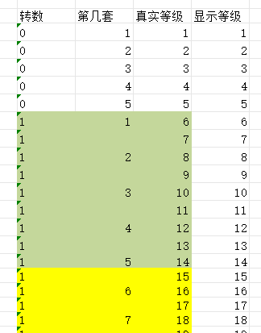

| 转数 | 第几套 | 真实等级 | 显示等级 |
| -- | --- | ---- | ---- |
| 0 | 1 | 1 | 1 |
| 0 | 2 | 2 | 2 |
| 0 | 3 | 3 | 3 |
| 0 | 4 | 4 | 4 |
| 0 | 5 | 5 | 5 |
| 1 | 1 | 6 | 6 |
| 1 |  | 7 | 7 |
| 1 | 2 | 8 | 8 |
| 1 |  | 9 | 9 |
| 1 | 3 | 10 | 10 |
| 1 |  | 11 | 11 |
| 1 | 4 | 12 | 12 |
| 1 |  | 13 | 13 |
| 1 | 5 | 14 | 14 |
| 1 |  | 15 | 15 |
| 1 | 6 | 16 | 16 |
| 1 |  | 17 | 17 |
| 1 | 7 | 18 | 18 |
| 1 |  | 19 | 19 |
| 1 | 8 | 20 | 20 |
| 1 |  | 21 | 21 |
| 1 | 9 | 22 | 22 |
| 1 |  | 23 | 23 |
| 1 | 10 | 24 | 24 |
| 1 |  | 25 | 25 |
| 1 | 11 | 26 | 26 |
| 1 |  | 27 | 27 |
| 1 | 12 | 28 | 28 |
| 1 |  | 29 | 29 |
| 1 | 13 | 30 | 30 |
| 1 |  | 31 | 31 |
| 1 | 14 | 32 | 32 |
| 1 |  | 33 | 33 |
| 1 | 15 | 34 | 34 |
| 1 |  | 35 | 35 |
| 1 | 16 | 36 | 36 |
| 1 |  | 37 | 37 |
| 1 | 17 | 38 | 38 |
| 1 |  | 39 | 39 |
| 1 | 18 | 40 | 40 |
| 1 |  | 41 | 41 |
| 1 | 19 | 42 | 42 |
| 1 |  | 43 | 43 |
| 1 | 20 | 44 | 44 |
| 1 |  | 45 | 45 |
| 1 | 21 | 46 | 46 |
| 1 |  | 47 | 47 |
| 1 | 22 | 48 | 48 |
| 1 |  | 49 | 49 |
| 1 | 23 | 50 | 50 |
| 2 |  | 51 | 51 |
| 2 | 1 | 52 | 52 |
| 2 |  | 53 | 53 |
| 2 | 2 | 54 | 54 |
| 2 |  | 55 | 55 |
| 2 | 3 | 56 | 56 |
| 2 |  | 57 | 57 |
| 2 | 4 | 58 | 58 |
| 2 |  | 59 | 59 |
| 2 | 5 | 60 | 60 |
| 2 |  | 61 | 61 |
| 2 | 6 | 62 | 62 |
| 2 |  | 63 | 63 |
| 2 | 7 | 64 | 64 |
| 2 |  | 65 | 65 |
| 2 | 8 | 66 | 66 |
| 2 |  | 67 | 67 |
| 2 | 9 | 68 | 68 |
| 2 |  | 69 | 69 |
| 2 | 10 | 70 | 70 |
| 2 |  | 71 | 71 |
| 2 | 11 | 72 | 72 |
| 2 |  | 73 | 73 |
| 2 | 12 | 74 | 74 |
| 2 |  | 75 | 75 |
| 2 | 13 | 76 | 76 |
| 2 |  | 77 | 77 |
| 2 | 14 | 78 | 78 |
| 2 |  | 79 | 79 |
| 2 | 15 | 80 | 80 |
| 2 |  | 81 | 81 |
| 2 | 16 | 82 | 82 |
| 2 |  | 83 | 83 |
| 2 | 17 | 84 | 84 |
| 2 |  | 85 | 85 |
| 2 | 18 | 86 | 86 |
| 2 |  | 87 | 87 |
| 2 | 19 | 88 | 88 |
| 2 |  | 89 | 89 |
| 2 | 20 | 90 | 90 |
| 2 |  | 91 | 91 |
| 2 | 21 | 92 | 92 |
| 2 |  | 93 | 93 |
| 2 | 22 | 94 | 94 |
| 2 |  | 95 | 95 |
| 2 | 23 | 96 | 96 |
| 2 |  | 97 | 97 |
| 2 | 24 | 98 | 98 |
| 2 |  | 99 | 99 |
| 2 | 25 | 100 | 100 |
| 3 |  | 101 | 101 |
| 3 | 1 | 102 | 102 |
| 3 |  | 103 | 103 |
| 3 | 2 | 104 | 104 |
| 3 |  | 105 | 105 |
| 3 | 3 | 106 | 106 |
| 3 |  | 107 | 107 |
| 3 | 4 | 108 | 108 |
| 3 |  | 109 | 109 |
| 3 | 5 | 110 | 110 |
| 3 |  | 111 | 111 |
| 3 | 6 | 112 | 112 |
| 3 |  | 113 | 113 |
| 3 | 7 | 114 | 114 |
| 3 |  | 115 | 115 |
| 3 | 8 | 116 | 116 |
| 3 |  | 117 | 117 |
| 3 | 9 | 118 | 118 |
| 3 |  | 119 | 119 |
| 3 | 10 | 120 | 120 |
| 3 |  | 121 | 121 |
| 3 | 11 | 122 | 122 |
| 3 |  | 123 | 123 |
| 3 | 12 | 124 | 124 |
| 3 |  | 125 | 125 |
| 3 | 13 | 126 | 126 |
| 3 |  | 127 | 127 |
| 3 | 14 | 128 | 128 |
| 3 |  | 129 | 129 |
| 3 | 15 | 130 | 130 |
| 3 |  | 131 | 131 |
| 3 | 16 | 132 | 132 |
| 3 |  | 133 | 133 |
| 3 | 17 | 134 | 134 |
| 3 |  | 135 | 135 |
| 3 | 18 | 136 | 136 |
| 3 |  | 137 | 137 |
| 3 | 19 | 138 | 138 |
| 3 |  | 139 | 139 |
| 3 | 20 | 140 | 140 |
| 3 |  | 141 | 141 |
| 3 | 21 | 142 | 142 |
| 3 |  | 143 | 143 |
| 3 | 22 | 144 | 144 |
| 3 |  | 145 | 145 |
| 3 | 23 | 146 | 146 |
| 3 |  | 147 | 147 |
| 3 | 24 | 148 | 148 |
| 3 |  | 149 | 149 |
| 3 | 25 | 150 | 150 |
| 3 |  | 151 | 151 |
| 3 | 26 | 152 | 152 |
| 3 |  | 153 | 153 |
| 3 | 27 | 154 | 154 |
| 3 |  | 155 | 155 |
| 3 | 28 | 156 | 156 |
| 3 |  | 157 | 157 |
| 3 | 29 | 158 | 158 |
| 3 |  | 159 | 159 |
| 3 | 30 | 160 | 160 |
| 3 |  | 161 | 161 |
| 3 | 31 | 162 | 162 |
| 3 |  | 163 | 163 |
| 3 | 32 | 164 | 164 |
| 3 |  | 165 | 165 |
| 3 | 33 | 166 | 166 |
| 3 |  | 167 | 167 |
| 3 | 34 | 168 | 168 |
| 3 |  | 169 | 169 |
| 3 | 35 | 170 | 170 |
| 3 |  | 171 | 171 |
| 3 | 36 | 172 | 172 |
| 3 |  | 173 | 173 |
| 3 | 37 | 174 | 174 |
| 3 |  | 175 | 175 |
| 3 | 38 | 176 | 176 |
| 3 |  | 177 | 177 |
| 3 | 39 | 178 | 178 |
| 3 |  | 179 | 179 |
| 3 | 40 | 180 | 180 |
| 3 |  | 181 | 181 |
| 3 | 41 | 182 | 182 |
| 3 |  | 183 | 183 |
| 3 | 42 | 184 | 184 |
| 3 |  | 185 | 185 |
| 3 | 43 | 186 | 186 |
| 3 |  | 187 | 187 |
| 3 | 44 | 188 | 188 |
| 3 |  | 189 | 189 |
| 3 | 45 | 190 | 190 |
| 3 |  | 191 | 191 |
| 3 | 46 | 192 | 192 |
| 3 |  | 193 | 193 |
| 3 | 47 | 194 | 194 |
| 3 |  | 195 | 195 |
| 3 | 48 | 196 | 196 |
| 3 |  | 197 | 197 |
| 3 | 49 | 198 | 198 |
| 3 |  | 199 | 199 |
| 3 | 50 | 200 | 200 |
| 4 |  | 201 | 201 |
| 4 | 1 | 202 | 202 |
| 4 |  | 203 | 203 |
| 4 | 2 | 204 | 204 |
| 4 |  | 205 | 205 |
| 4 | 3 | 206 | 206 |
| 4 |  | 207 | 207 |
| 4 | 4 | 208 | 208 |
| 4 |  | 209 | 209 |
| 4 | 5 | 210 | 210 |
| 4 |  | 211 | 211 |
| 4 | 6 | 212 | 212 |
| 4 |  | 213 | 213 |
| 4 | 7 | 214 | 214 |
| 4 |  | 215 | 215 |
| 4 | 8 | 216 | 216 |
| 4 |  | 217 | 217 |
| 4 | 9 | 218 | 218 |
| 4 |  | 219 | 219 |
| 4 | 10 | 220 | 220 |
| 4 |  | 221 | 221 |
| 4 | 11 | 222 | 222 |
| 4 |  | 223 | 223 |
| 4 | 12 | 224 | 224 |
| 4 |  | 225 | 225 |
| 4 | 13 | 226 | 226 |
| 4 |  | 227 | 227 |
| 4 | 14 | 228 | 228 |
| 4 |  | 229 | 229 |
| 4 | 15 | 230 | 230 |
| 4 |  | 231 | 231 |
| 4 | 16 | 232 | 232 |
| 4 |  | 233 | 233 |
| 4 | 17 | 234 | 234 |
| 4 |  | 235 | 235 |
| 4 | 18 | 236 | 236 |
| 4 |  | 237 | 237 |
| 4 | 19 | 238 | 238 |
| 4 |  | 239 | 239 |
| 4 | 20 | 240 | 240 |
| 4 |  | 241 | 241 |
| 4 | 21 | 242 | 242 |
| 4 |  | 243 | 243 |
| 4 | 22 | 244 | 244 |
| 4 |  | 245 | 245 |
| 4 | 23 | 246 | 246 |
| 4 |  | 247 | 247 |
| 4 | 24 | 248 | 248 |
| 4 |  | 249 | 249 |
| 4 | 25 | 250 | 250 |
| 4 |  | 251 | 251 |
| 4 | 26 | 252 | 252 |
| 4 |  | 253 | 253 |
| 4 | 27 | 254 | 254 |
| 4 |  | 255 | 255 |
| 4 | 28 | 256 | 256 |
| 4 |  | 257 | 257 |
| 4 | 29 | 258 | 258 |
| 4 |  | 259 | 259 |
| 4 | 30 | 260 | 260 |
| 4 |  | 261 | 261 |
| 4 | 31 | 262 | 262 |
| 4 |  | 263 | 263 |
| 4 | 32 | 264 | 264 |
| 4 |  | 265 | 265 |
| 4 | 33 | 266 | 266 |
| 4 |  | 267 | 267 |
| 4 | 34 | 268 | 268 |
| 4 |  | 269 | 269 |
| 4 | 35 | 270 | 270 |
| 4 |  | 271 | 271 |
| 4 | 36 | 272 | 272 |
| 4 |  | 273 | 273 |
| 4 | 37 | 274 | 274 |
| 4 |  | 275 | 275 |
| 4 | 38 | 276 | 276 |
| 4 |  | 277 | 277 |
| 4 | 39 | 278 | 278 |
| 4 |  | 279 | 279 |
| 4 | 40 | 280 | 280 |
| 4 |  | 281 | 281 |
| 4 | 41 | 282 | 282 |
| 4 |  | 283 | 283 |
| 4 | 42 | 284 | 284 |
| 4 |  | 285 | 285 |
| 4 | 43 | 286 | 286 |
| 4 |  | 287 | 287 |
| 4 | 44 | 288 | 288 |
| 4 |  | 289 | 289 |
| 4 | 45 | 290 | 290 |
| 4 |  | 291 | 291 |
| 4 | 46 | 292 | 292 |
| 4 |  | 293 | 293 |
| 4 | 47 | 294 | 294 |
| 4 |  | 295 | 295 |
| 4 | 48 | 296 | 296 |
| 4 |  | 297 | 297 |
| 4 | 49 | 298 | 298 |
| 4 |  | 299 | 299 |
| 4 | 50 | 300 | 300 |

---

## 区块 6 · 稀有度/随机词条数量表（AZ:BC, 行 11~17）

品质(稀有度) → 普通词条低级库/高级库数量。被 Y「初始随机属性库id」查取。

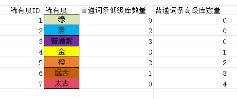

| 稀有度ID | 稀有度 | 普通词条低级库数量 | 普通词条高级库数量 |
| ----- | --- | --------- | --------- |
| 1 | 绿 | 0 | 0 |
| 2 | 蓝 | 2 | 0 |
| 3 | 普通紫 | 3 | 0 |
| 4 | 金 | 3 | 1 |
| 5 | 橙 | 2 | 2 |
| 6 | 远古 | 1 | 3 |
| 7 | 太古 | 0 | 4 |

---

## 区块 7 · 挂件/模型ID清单（BE:BL, 行 11~20）

按职业×部位列出各装备的挂件ID（武器icon、防具模型组），供 AG「挂件ID」手填时参照。BE/BF=剑1/剑2（战士）、BG/BH=弓1/弓2、BI/BJ=法1/法2、BK/BL=牧1/牧2。

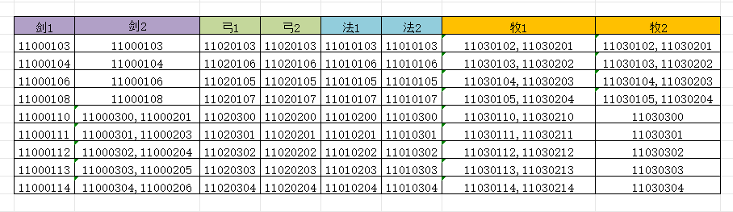

| 剑1 | 剑2 | 弓1 | 弓2 | 法1 | 法2 | 牧1 | 牧2 |
| -------- | ----------------- | -------- | -------- | -------- | -------- | ----------------- | ----------------- |
| 11000103 | 11000103 | 11020103 | 11020103 | 11010103 | 11010103 | 11030102,11030201 | 11030102,11030201 |
| 11000104 | 11000104 | 11020106 | 11020106 | 11010106 | 11010106 | 11030103,11030202 | 11030103,11030202 |
| 11000106 | 11000106 | 11020105 | 11020105 | 11010105 | 11010105 | 11030104,11030203 | 11030104,11030203 |
| 11000108 | 11000108 | 11020107 | 11020107 | 11010107 | 11010107 | 11030105,11030204 | 11030105,11030204 |
| 11000110 | 11000300,11000201 | 11020300 | 11020200 | 11010200 | 11010300 | 11030110,11030210 | 11030300 |
| 11000111 | 11000301,11000203 | 11020301 | 11020201 | 11010201 | 11010301 | 11030111,11030211 | 11030301 |
| 11000112 | 11000302,11000204 | 11020302 | 11020202 | 11010202 | 11010302 | 11030112,11030212 | 11030302 |
| 11000113 | 11000303,11000205 | 11020303 | 11020203 | 11010203 | 11010303 | 11030113,11030213 | 11030303 |
| 11000114 | 11000304,11000206 | 11020304 | 11020204 | 11010204 | 11010304 | 11030114,11030214 | 11030304 |

---

## 区块 8 · 套装命名辅助矩阵（BO:BX, 行 8~16）

用公式把「基础职业 + 转数 + 分支 + 第几套」四段拼接，批量生成套装编码索引（拼接顺序：职业9 → 转数 → 分支8 → 第几套）。BP8/BP9 是"分支 / 基础职业"的表头标记。属于内部生成的索引区。

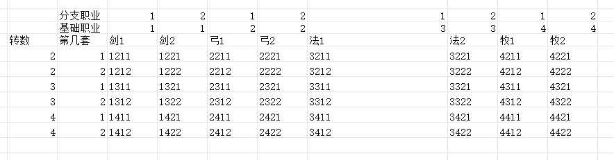

|  | 分支职业 | 1 | 2 | 1 | 2 | 1 | 2 | 1 | 2 |
| -- | ---- | ---- | ---- | ---- | ---- | ---- | ---- | ---- | ---- |
|  | 基础职业 | 1 | 1 | 2 | 2 | 3 | 3 | 4 | 4 |
| 转数 | 第几套 | 剑1 | 剑2 | 弓1 | 弓2 | 法1 | 法2 | 牧1 | 牧2 |
| 2 | 1 | 1211 | 1221 | 2211 | 2221 | 3211 | 3221 | 4211 | 4221 |
| 2 | 2 | 1212 | 1222 | 2212 | 2222 | 3212 | 3222 | 4212 | 4222 |
| 3 | 1 | 1311 | 1321 | 2311 | 2321 | 3311 | 3321 | 4311 | 4321 |
| 3 | 2 | 1312 | 1322 | 2312 | 2322 | 3312 | 3322 | 4312 | 4322 |
| 4 | 1 | 1411 | 1421 | 2411 | 2421 | 3411 | 3421 | 4411 | 4421 |
| 4 | 2 | 1412 | 1422 | 2412 | 2422 | 3412 | 3422 | 4412 | 4422 |

---

## 区块 9 · 命名组等级划分表（CE:CF, 行 15~21）

把"等级"映射到"命名组编号"。被装备名称公式里的 `XLOOKUP(Q,CE:CE,CF:CF)` 使用。

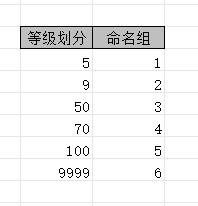

| 等级划分(≤) | 命名组 |
| ---- | --- |
| 5 | 1 |
| 9 | 2 |
| 50 | 3 |
| 70 | 4 |
| 100 | 5 |
| 9999 | 6 |

---

## 区块 10 · 装备命名词库（CK:DT, 行 15~39）★

装备名称的核心词库。主键：命名组CK + 转数CL + 品质CM（+等级CN）。列 CO~DD 是各职业分支的"命名词"。

- `CO~DD`（行16 表头）：0转剑士 / 0转弓手 / … / 2转剑士 / 2转盾剑 / 2转魔弓 / 2转炮手 / 2转奥法 / 2转元素 / 2转光牧 / 2转暗牧
- `DE~DT`：**品质5以上武器专用**命名组（行14 标注）
- 词样例（按转数/品质递进）：`粗制旅人` → `旅人` → `先锋` / `卓越先锋` → `曼荼罗` / `紫星石` / `璀璨紫星石` → `精良逐风/磐石/飞羽…` → `无暇逐风…` → `龙击/龙护…` → `魂闪/魂壁…` → `血饮…` → `裁决/庇佑…`

被 AJ「装备名称内容」公式查取，拼出如"粗制旅人长剑"。

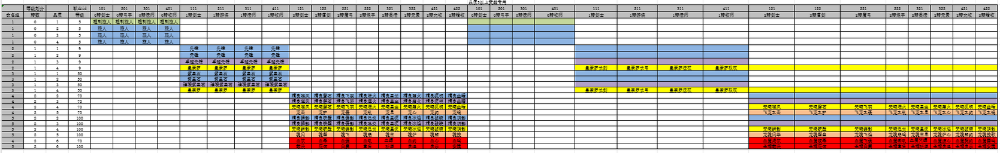

| 命名组 | 转数 | 品质 | 等级 | 0转剑士 | 0转弓手 | 0转法师 | 0转牧师 | 1转剑士 | 1转游侠 | 1转法师 | 1转牧师 | 2转剑士 | 2转盾剑 | 2转魔弓 | 2转炮手 | 2转奥法 | 2转元素 | 2转光牧 | 2转暗牧 | 武器·2转剑士 | 武器·2转盾剑 | 武器·2转魔弓 | 武器·2转炮手 | 武器·2转奥法 | 武器·2转元素 | 武器·2转光牧 | 武器·2转暗牧 |
| --- | -- | -- | -- | ---- | ---- | ---- | ---- | ----- | ----- | ----- | ----- | ---- | ---- | ---- | ---- | ---- | ---- | ---- | ---- | ----- | ----- | ----- | ----- | ---- | ---- | ---- | ---- |
| 1 | 0 | 1 | 5 | 粗制旅人 | 粗制旅人 | 粗制旅人 | 粗制旅人 |  |  |  |  |  |  |  |  |  |  |  |  |  |  |  |  |  |  |  |  |
| 1 | 0 | 2 | 5 | 旅人 | 旅人 | 旅人 | 旅人 |  |  |  |  |  |  |  |  |  |  |  |  |  |  |  |  |  |  |  |  |
| 1 | 0 | 3 | 5 | 旅人 | 旅人 | 旅人 | 旅人 |  |  |  |  |  |  |  |  |  |  |  |  |  |  |  |  |  |  |  |  |
| 1 | 0 | 4 | 5 | 旅人 | 旅人 | 旅人 | 旅人 |  |  |  |  |  |  |  |  |  |  |  |  |  |  |  |  |  |  |  |  |
| 2 | 1 | 1 | 9 |  |  |  |  | 先锋 | 先锋 | 先锋 | 先锋 |  |  |  |  |  |  |  |  |  |  |  |  |  |  |  |  |
| 2 | 1 | 2 | 9 |  |  |  |  | 先锋 | 先锋 | 先锋 | 先锋 |  |  |  |  |  |  |  |  |  |  |  |  |  |  |  |  |
| 2 | 1 | 3 | 9 |  |  |  |  | 卓越先锋 | 卓越先锋 | 卓越先锋 | 卓越先锋 |  |  |  |  |  |  |  |  |  |  |  |  |  |  |  |  |
| 2 | 1 | 4 | 9 |  |  |  |  | 曼荼罗 | 曼荼罗 | 曼荼罗 | 曼荼罗 |  |  |  |  |  |  |  |  | 曼荼罗长剑 | 曼荼罗长弓 | 曼荼罗法杖 | 曼荼罗权杖 |  |  |  |  |
| 3 | 1 | 1 | 50 |  |  |  |  | 紫星石 | 紫星石 | 紫星石 | 紫星石 |  |  |  |  |  |  |  |  |  |  |  |  |  |  |  |  |
| 3 | 1 | 2 | 50 |  |  |  |  | 紫星石 | 紫星石 | 紫星石 | 紫星石 |  |  |  |  |  |  |  |  |  |  |  |  |  |  |  |  |
| 3 | 1 | 3 | 50 |  |  |  |  | 璀璨紫星石 | 璀璨紫星石 | 璀璨紫星石 | 璀璨紫星石 |  |  |  |  |  |  |  |  |  |  |  |  |  |  |  |  |
| 3 | 1 | 4 | 50 |  |  |  |  | 曼荼罗 | 曼荼罗 | 曼荼罗 | 曼荼罗 |  |  |  |  |  |  |  |  | 曼荼罗长剑 | 曼荼罗长弓 | 曼荼罗法杖 | 曼荼罗权杖 |  |  |  |  |
| 4 | 2 | 2 | 70 |  |  |  |  |  |  |  |  | 精良逐风 | 精良磐石 | 精良飞羽 | 精良迸火 | 精良星尘 | 精良霜火 | 精良流明 | 精良幽暗 |  |  |  |  |  |  |  |  |
| 4 | 2 | 3 | 70 |  |  |  |  |  |  |  |  | 精良逐风 | 精良磐石 | 精良飞羽 | 精良迸火 | 精良星尘 | 精良霜火 | 精良流明 | 精良幽暗 |  |  |  |  |  |  |  |  |
| 4 | 2 | 4 | 70 |  |  |  |  |  |  |  |  | 无暇逐风 | 无暇磐石 | 无暇飞羽 | 无暇迸火 | 无暇星尘 | 无暇霜火 | 无暇流明 | 无暇幽暗 |  |  |  |  | 无暇逐风 | 无暇磐石 | 无暇飞羽 | 无暇迸火 |
| 4 | 2 | 5 | 70 |  |  |  |  |  |  |  |  | 龙击 | 龙护 | 龙袭 | 龙吼 | 龙息 | 龙心 | 龙约 | 龙鸣 |  |  |  |  | 飞龙之击 | 飞龙之护 | 飞龙之袭 | 飞龙之吼 |
| 5 | 2 | 2 | 100 |  |  |  |  |  |  |  |  | 精良瞬影 | 精良铁壁 | 精良袭影 | 精良迅炎 | 精良星流 | 精良冰焰 | 精良破晓 | 精良阴影 |  |  |  |  |  |  |  |  |
| 5 | 2 | 3 | 100 |  |  |  |  |  |  |  |  | 精良瞬影 | 精良铁壁 | 精良袭影 | 精良迅炎 | 精良星流 | 精良冰焰 | 精良破晓 | 精良阴影 |  |  |  |  |  |  |  |  |
| 5 | 2 | 4 | 100 |  |  |  |  |  |  |  |  | 无暇瞬影 | 无暇铁壁 | 无暇袭影 | 无暇迅炎 | 无暇星流 | 无暇冰焰 | 无暇破晓 | 无暇阴影 |  |  |  |  | 无暇瞬影 | 无暇铁壁 | 无暇袭影 | 无暇迅炎 |
| 5 | 2 | 5 | 100 |  |  |  |  |  |  |  |  | 魂闪 | 魂壁 | 魂飞 | 魂崩 | 魂生 | 魂炉 | 魂盟 | 魂挽 |  |  |  |  | 龙魂闪华 | 龙魂壁垒 | 龙魂飞焰 | 龙魂崩鸣 |
| 4 | 2 | 6 | 70 |  |  |  |  |  |  |  |  | 血饮 | 血幕 | 血袭 | 血吼 | 血缚 | 血约 | 血心 | 血鸣 |  |  |  |  | 血魔渴饮 | 血魔夜幕 | 血魔飞袭 | 血魔嘶吼 |
| 5 | 2 | 6 | 100 |  |  |  |  |  |  |  |  | 裁决 | 庇佑 | 白翼 | 宣告 | 祈愿 | 启迪 | 启示 | 安魂 |  |  |  |  | 圣辉裁决 | 圣辉庇佑 | 圣辉白翼 | 圣辉宣告 |

> 上表为节选可读版（每个命名组×品质各取一行代表）。右半区(DE~DT)是品质5+武器专用命名组，与左半区命名词成对。完整 34 列原表见截图。

---

## 区块 11 · 部位词表（GA:GJ, 行 14~25）★

把"部位编号"翻成"各职业风格的部位词"。被装备名称/描述公式拼在词尾。GC/GD、GE/GF、GG/GH、GI/GJ 成对，分别是该职业两个分支的部位词。

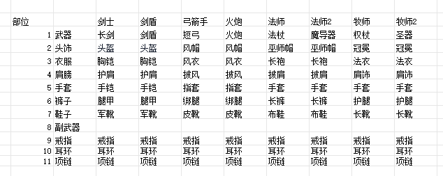

| 部位 |  | 剑士 | 剑盾 | 弓箭手 | 火炮 | 法师 | 法师2 | 牧师 | 牧师2 |
| -- | --- | -- | -- | --- | -- | --- | --- | -- | --- |
| 1 | 武器 | 长剑 | 剑盾 | 短弓 | 火炮 | 法杖 | 魔导器 | 权杖 | 圣器 |
| 2 | 头饰 | 头盔 | 头盔 | 风帽 | 风帽 | 巫师帽 | 巫师帽 | 冠冕 | 冠冕 |
| 3 | 衣服 | 胸铠 | 胸铠 | 风衣 | 风衣 | 长袍 | 长袍 | 法衣 | 法衣 |
| 4 | 肩膀 | 护肩 | 护肩 | 披风 | 披风 | 披肩 | 披肩 | 肩饰 | 肩饰 |
| 5 | 手套 | 手铠 | 手铠 | 指套 | 指套 | 手套 | 手套 | 手套 | 手套 |
| 6 | 裤子 | 腿甲 | 腿甲 | 绑腿 | 绑腿 | 长裤 | 长裤 | 护腿 | 护腿 |
| 7 | 鞋子 | 军靴 | 军靴 | 皮靴 | 皮靴 | 布鞋 | 布鞋 | 长靴 | 长靴 |
| 8 | 副武器 |  |  |  |  |  |  |  |  |
| 9 | 戒指 | 戒指 | 戒指 | 戒指 | 戒指 | 戒指 | 戒指 | 戒指 | 戒指 |
| 10 | 耳环 | 耳环 | 耳环 | 耳环 | 耳环 | 耳环 | 耳环 | 耳环 | 耳环 |
| 11 | 项链 | 项链 | 项链 | 项链 | 项链 | 项链 | 项链 | 项链 | 项链 |

---

## 区块 12 · 装备描述文案库（FP:FT, 行 17~38）

装备描述的句子库。主键：命名组FP + 转数FQ + 品质FR。FS=描述前半句、FT=后半句。被 AL「装备描述内容」拼接。最终描述 = 命名词 + FS前半句 + 部位词 + FT后半句。

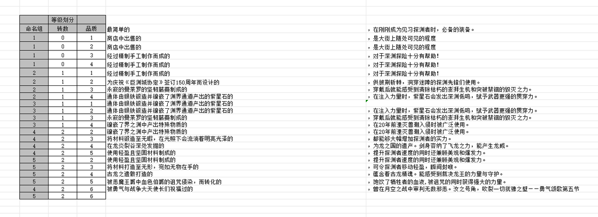

| 命名组 | 转数 | 品质 | 前半句(FS) | 后半句(FT) |
| --- | ---- | -- | ---------------------- | ------------------------------------- |
|  |  |  | 最简单的 | ，在刚刚成为见习探渊者时，必备的装备。 |
| 1 | 0 | 1 | 商店中出售的 | ，是大街上随处可见的程度 |
| 1 | 0 | 2 | 商店中出售的 | ，是大街上随处可见的程度 |
| 1 | 0 | 3 | 经过精制手工制作而成的 | ，对于深渊探险十分有帮助！ |
| 1 | 0 | 4 | 经过精制手工制作而成的 | ，对于深渊探险十分有帮助！ |
| 2 | 1 | 1 | 经过精制手工制作而成的 | ，对于深渊探险十分有帮助！ |
| 2 | 1 | 2 | 为庆祝《巨渊城协定》签订150周年而设计的 | ，供披荆斩棘，洞穿迷障的探渊先锋们使用。 |
| 2 | 1 | 3 | 永寂的曼荼罗的坚韧藤蔓制成的 | ，穿戴后就能感受到清除枯朽的澎湃生机和突破禁锢的毁灭之力。 |
| 2 | 1 | 4 | 通体由银铁锻造并镶嵌了渊界通道产出的紫星石的 | ，在注入力量时，紫星石会发出深渊低鸣，赋予武器更强的贯穿力。 |
| 3 | 1 | 1 | 通体由银铁锻造并镶嵌了渊界通道产出的紫星石的 |  |
| 3 | 1 | 2 | 通体由银铁锻造并镶嵌了渊界通道产出的紫星石的 | ，在注入力量时，紫星石会发出深渊低鸣，赋予武器更强的贯穿力。 |
| 3 | 1 | 3 | 永寂的曼荼罗的坚韧藤蔓制成的 | ，穿戴后就能感受到清除枯朽的澎湃生机和突破禁锢的毁灭之力。 |
| 3 | 1 | 4 | 镶嵌了界之渊中产出特殊物质的 | ，在20年前湮灭兽潮入侵时被广泛使用。 |
| 4 | 2 | 2 | 镶嵌了界之渊中产出特殊物质的 | ，在20年前湮灭兽潮入侵时被广泛使用。 |
| 4 | 2 | 3 | 将材料锻造至无暇，在光照下会流淌着明亮光泽的 | ，都能够大幅增加探渊者的实力。 |
| 4 | 2 | 4 | 在龙炎裂谷深处发掘的 | ，为龙之国的遗产。剑身容纳了飞龙之力，能产生龙威。 |
| 4 | 2 | 5 | 使用轻盈且坚固材料制成的 | ，提升探渊者速度的同时还兼顾美观和爆发力。 |
| 5 | 2 | 2 | 使用轻盈且坚固材料制成的 | ，提升探渊者速度的同时还兼顾美观和爆发力。 |
| 5 | 2 | 3 | 将材料打造至无形，宛如无物在手的 | ，可令探渊者移动轻盈，瞬间封喉。 |
| 5 | 2 | 4 | 古龙之遗骸打造的 | ，蕴含着古龙精魂。能感受到裁决龙王的力量与守护。 |
| 5 | 2 | 5 | 被恶魔王爵中血色伯爵的诅咒侵染，而转化的 | ，饱饮了牺牲者的血液,被诅咒的同时获得强大的力量。 |
| 4 | 2 | 6 | 被勇气与战争大天使长们祝福过的 | ，曾在月空之战中审判无数邪恶。汝之号角，吹裂一切犹豫之壁——勇气颂歌第五节 |
| 5 | 2 | 6 |  |  |

---

## 区块 13 · 武器图标资源表（DG:DQ, 行 57~69）

按职业列出武器 icon 资源名，供 AM「装备图标」参照。

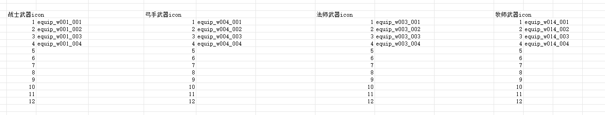

| 序号 | 战士武器icon | 弓手武器icon | 法师武器icon | 牧师武器icon |
| -- | -------- | -------- | -------- | -------- |
| 1 | equip_w001_001 | equip_w004_001 | equip_w003_001 | equip_w014_001 |
| 2 | equip_w001_002 | equip_w004_002 | equip_w003_002 | equip_w014_002 |
| 3 | equip_w001_003 | equip_w004_003 | equip_w003_003 | equip_w014_003 |
| 4 | equip_w001_004 | equip_w004_004 | equip_w003_004 | equip_w014_004 |
| 5~12 | （留空待配） | | | |

---

## 区块 14 · 点亮积分设定表（S:T, 行 28~35）

品质(稀有度) → 散件点数。被 AS「散件点数」的 VLOOKUP 查取。

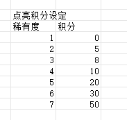

| 稀有度 | 积分 |
| ------ | -- |
| 1 | 0 |
| 2 | 5 |
| 3 | 8 |
| 4 | 10 |
| 5 | 20 |
| 6 | 30 |
| 7 | 50 |

---

## 外部依赖说明

主数据页 N、O 列引用了 `[1]Sheet1`——`[1]` 经查是 **`equip_rare.xlsx`（装备稀有度表）**（品质→道具品质/强度子品质映射），不在 Sheet4 内。迁移或重构时需一并处理。
