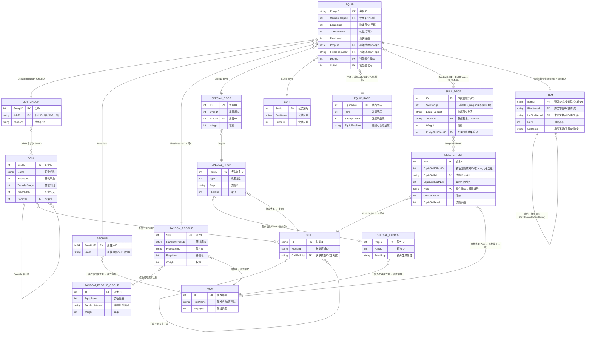
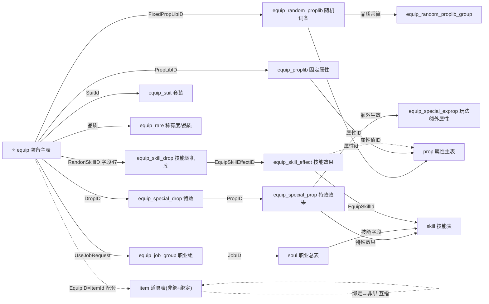

# 08 · equip 装备配置链 · ER 关系图

整条装备数据链共 **17 张配置表 = 活跃 16 + 废弃 1**（活跃含与 equip 配套的道具表 item、属性主表 prop、技能表 skill、装备技能随机库 equip_skill_drop + equip_skill_effect；废弃 1 = equip_random_proplib_skill，已被 equip_skill_drop/effect 取代、**不计入活跃表数**；[09](09_关联表字段清单.md) 目录按活跃 16 张列），另有通用语言表 language 被多表引用。下面用 Mermaid ER 图表示它们之间的主键(PK)/外键(FK)关联。

> 在支持 Mermaid 的编辑器（飞书文档、Typora、VS Code 预览、GitHub）里可直接渲染。

---

## 完整 ER 图

---

## 关系速读

| 关系 | 类型 | 含义 |
|------|------|------|
| EQUIP → JOB_GROUP | 多对一 | 多件装备共用一个职业组 |
| EQUIP → PROPLIB | 多对一 | 装备指向一条固定属性 |
| EQUIP → RANDOM_PROPLIB | 多对一 | 装备指向一个随机词条库 |
| EQUIP → SPECIAL_DROP | 多对一(可空) | 仅带"特效"的装备才有 |
| EQUIP → SUIT | 多对一(可空) | 仅套装装备才有 |
| EQUIP → EQUIP_RARE | 多对一 | 按品质查道具品质/强度子品质（外部链接，N列草稿用） |
| JOB_GROUP ↔ SOUL | 多对多 | 一个组含多个职业，一个职业可在多组 |
| SOUL → SOUL | 自关联 | ParentId 构成职业树（基础→转职→分支） |
| RANDOM_PROPLIB → RANDOM_PROPLIB_GROUP | 多对一 | 按装备品质取乘算比例与概率 |
| SPECIAL_DROP → SPECIAL_PROP | 多对一 | 特效库条目指向具体效果 |
| SPECIAL_PROP → SPECIAL_EXPROP | 多对一(可空) | 玩法/位面限定的额外属性（当前空表） |
| EQUIP ↔ ITEM | 一对一 | 装备道具的 ItemId = 装备ID，每件装备配套一条道具 |
| ITEM ↔ ITEM | 一对一(配对) | 非绑道具与绑定道具互指（绑定版="8"+ID），靠 BindItemId/UnBindItemId |
| PROPLIB / RANDOM_PROPLIB / SPECIAL_EXPROP → PROP | 多对一 | 各表的"属性ID"指向属性主表 prop 的属性编号 |
| SPECIAL_PROP → SKILL | 多对一 | 特效的"特殊效果"指向技能表 skill |
| EQUIP → SKILL_DROP | 多对一(可空,可多值) | 字段47「装备技能随机库」，值=技能组ID(可多个分号分隔)，按 SkillGroup 分组取候选技能 |
| SKILL_DROP → SKILL_EFFECT | 多对多 | 每条候选技能经 EquipSkillEffectID 指向具体效果配置 |
| SKILL_EFFECT → SKILL | 多对一 | 效果的 EquipSkillId 指向技能表 skill |
| SKILL_EFFECT → PROP | 多对一(可空) | 效果附带固定属性的"属性ID"指向属性主表 prop |
| SOUL → SKILL | 多对多 | 职业的初始技能/闪避/普攻指向技能表 skill |
| SKILL → SKILL | 自关联 | 关联技能ID 引用其它技能 |

---

## 简化版（只看主表对外的直连）

给只想抓主干的人——equip 主表直接连出去的表：

> equip 与 item 是**配套**关系（虚线）：每件装备在 item 表里配一条非绑道具 + 一条绑定道具（ID 差"8"前缀），装备道具的 ItemId 就是装备的 EquipID。

---

## 表清单（活跃 16 + 废弃 1 = 17 张配置表 + 通用语言表）

| # | 表 | 角色 | 详见 |
|---|----|----|------|
| 1 | equip | 装备主表（清单+指针） | [02](02_字段字典与公式拆解.md) / [05](05_字段清单表.md) |
| 2 | equip_job_group | 职业组（谁能穿） | [06](06_关联配置表说明.md) |
| 3 | equip_proplib | 固定基础属性 | [06](06_关联配置表说明.md) |
| 4 | equip_random_proplib | 随机词条池（含1000x技能段） | [06](06_关联配置表说明.md) |
| 5 | equip_special_drop | 特效库 | [06](06_关联配置表说明.md) |
| 6 | equip_suit | 套装 | [06](06_关联配置表说明.md) |
| 7 | equip_random_proplib_group | 随机词条品质乘算/概率 | [07](07_深层依赖表说明.md) |
| 8 | equip_special_prop | 特效具体效果(技能) | [07](07_深层依赖表说明.md) |
| 9 | soul | 职业总表/职业树根表 | [07](07_深层依赖表说明.md) |
| 10 | equip_special_exprop | 玩法/位面限定额外属性(当前空) | [07](07_深层依赖表说明.md) |
| 11 | equip_rare | 装备稀有度/品质映射 | [07](07_深层依赖表说明.md) |
| 12 | equip_random_proplib_skill | 技能随机库（⚠️ 废弃冗余，已被 equip_skill_drop/effect 取代） | [07](07_深层依赖表说明.md) |
| 13 | item | 道具表（与 equip 配套，含非绑/绑定） | [09](09_关联表字段清单.md) |
| 14 | prop | 属性主表（属性名↔属性编号） | [09](09_关联表字段清单.md) |
| 15 | skill | 技能表（特效/职业技能） | [09](09_关联表字段清单.md) |
| 16 | equip_skill_drop | 装备技能随机库（字段47，按技能组分组、走权重） | [09](09_关联表字段清单.md) |
| 17 | equip_skill_effect | 装备技能效果（技能/套装件数/属性/评分/转变外观） | [09](09_关联表字段清单.md) |
| — | language | 通用语言表（被多表语言包key引用） | [09](09_关联表字段清单.md) |
